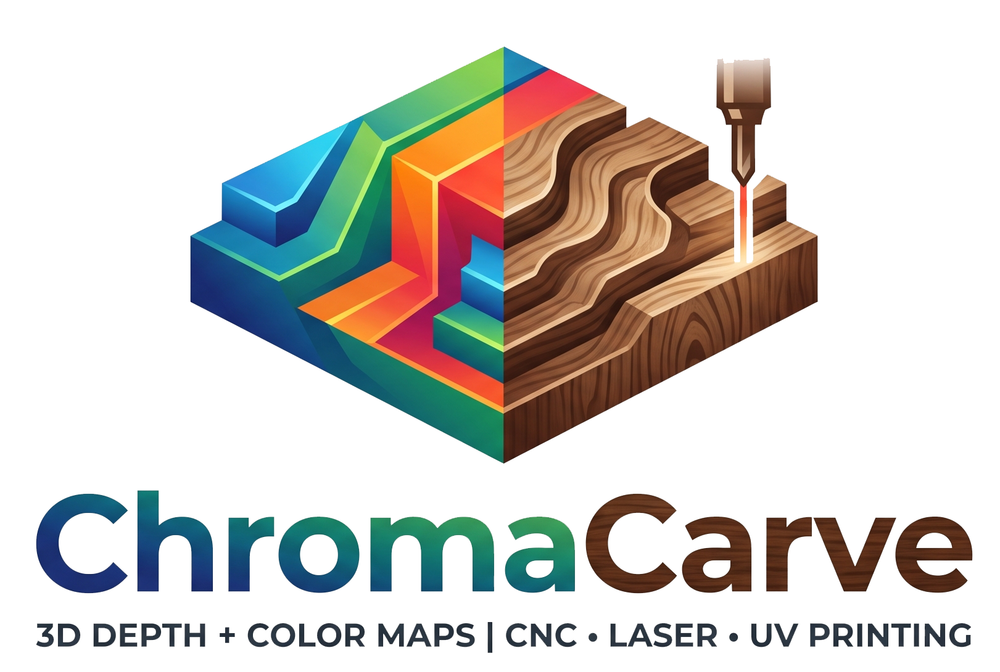

<p align="center">
  
</p>

# ChromaCarve

A browser tool for compositing a **color map** + a matching **depth/height map** for
CNC relief carving (depth only) and full-color 3D printing (depth + color). The
composite is built from three independently-optional parts, textured with procedural
materials, and previewed in a lit, orbitable 3D view — entirely client-side.

## Run

```bash
npm install
npm run dev      # http://localhost:5173
npm run build    # type-check + production build
npm test         # vitest unit tests
```

## The three parts

The image is composited from three parts, combined by **priority replace**
(`foreground ?? frame ?? background` per pixel). Each is toggled on/off independently
and has its own depth `min`/`max` (relative height units).

- **Foreground** — the main subject. Use an uploaded **OBJ** or a procedural primitive
  (**torus, sphere, torus knot, cube**), freely oriented in an orbit gizmo. The depth map
  is the **orthographic** projection from the angle you set — what you see in the gizmo is
  what you get. Offset it in X/Y within the canvas.
- **Frame** — a border band whose cross-section is a Catmull-Rom **spline profile** (drag
  points; double-click empty space to add a point, double-click a point to remove it),
  with its own width and fill.
- **Background** — an uploaded **image** (Gaussian blur + brightness/contrast/desaturation;
  flat constant depth), an **OBJ/primitive tiled** across the canvas at a chosen interval
  (overlaps take the per-pixel **max** height, e.g. dragon scales), or a **solid color**.

Output size is physical (mm + px/mm).

## Materials

Every part is textured with a **Fill**, evaluated procedurally in canvas space:

- **Solid color.**
- **Wood grain** — a volumetric model with three grain layouts: **flat-sawn** and
  **end-grain**, where grain lines are slices through concentric growth-ring cylinders
  around a wandering pith axis (realistic cathedral flames, irregular ring spacing, thin
  latewood lines, high-frequency pores, heart-colour zoning); and **figured**, a
  domain-warped-noise wood with dense fibrous grit and knots (see credits). Species
  presets: **Walnut, Oak, Mahogany, Redwood, Poplar, Olive, Rosewood**. Knobs cover ring
  density, pith depth/wander, grain turbulence, line sharpness, colour zoning, pores,
  figure streak, per-ring variation and saturation.
- **Stone** — volumetric **marble, onyx, sandstone, granite, terrazzo, travertine** and
  **cracked** stone (veins, strata, Voronoi aggregates/cracks), with curated presets.

Wood and stone are sampled in 3D, so their veins/rings carve correctly through raised and
recessed relief. A 🎲 button randomizes the material seed. **Micro-relief** can emboss a
material's feature lines (wood grooves, marble veins, travertine voids) into the depth map.

## Depth & relief

The foreground offers two **geometry modes**:

- **Bas-relief** — gradient-domain relief (Fattal et al. 2002 / Weyrich et al. 2007):
  dissolves silhouette cliffs and compresses large gradients while preserving fine detail,
  controlled by compression (β), detail level (α) and edge emergence.
- **Pure depth** — the raw orthographic height field, with an edge-falloff option to
  feather vertical silhouette cliffs.

Shared depth controls: maximize/normalize the range, detail (unsharp mask), a depth curve
(γ), and 2× supersampling for cleaner edges. **Shading** can bake ambient occlusion and
fine curvature (concave/convex) shading into the colour map.

## 3D preview

The full-viewport preview displaces a high-res plane by the depth map, shaded in-shader
with a specular highlight and a key light:

- **Drag** to orbit (constrained to the front hemisphere so you can't swing behind the
  relief), **scroll** to zoom, **right-drag** to pan.
- Toggle **Rotate light source** to sweep the light or hold it in place.
- In the foreground orbit gizmo (an orthographic view matching the exported maps), the
  **scroll wheel** drives the model zoom and a **Roll** slider rotates about the view axis.

`previewMaxDepthMm` and preview px/mm only affect the on-screen preview, not the export.

## Export

- **Depth PNG** — 16-bit grayscale, normalized so the used range spans full black→white
  (the PNG carries no physical scale — set that in your CAM/slicer).
- **Color PNG** — 8-bit RGBA.
- **Settings JSON** — all parameters (binary assets are referenced by filename; re-upload
  them after importing).

## Architecture

- `src/state/store.ts` — Zustand project model (= the JSON export schema).
- `src/pipeline/` — offscreen Three.js render-target pipeline: per-part color/depth/mask
  stages + the priority-replace compositor, all on float targets. `shaders.ts` holds the
  shared procedural core and the wood/stone material shaders.
- `src/obj/ModelDepthPass.ts` — orthographic model→height-map renderer (shared by the
  foreground, the background tile and the orbit gizmo).
- `src/relief/` — gradient-domain bas-relief solver (Poisson/DCT), run in a worker.
- `src/spline/profile.ts` — Catmull-Rom profile sampling for the frame LUT.
- `src/three/Viewer3D.tsx` — displacement mesh, in-shader normals, key light + specular.
- `src/io/` — PNG (`fast-png`) and project-JSON export/import.

## Credits

- The **figured** wood grain layout is an independent reimplementation of the technique in
  [dean_the_coder](https://twitter.com/deanthecoder)'s "Procedural Wood" shader
  ([shadertoy.com/view/mdy3R1](https://www.shadertoy.com/view/mdy3R1)) — domain-warped noise
  flow with a spectral-fBm tone transfer and fine anisotropic grain. Its **algorithm** was
  reimplemented here on ChromaCarve's own noise primitives and code (no source was copied);
  the original shader is licensed CC BY-NC-SA 3.0. With thanks to the author.
- 3D simplex noise: Ashima Arts / Stefan Gustavson (MIT, webgl-noise).
