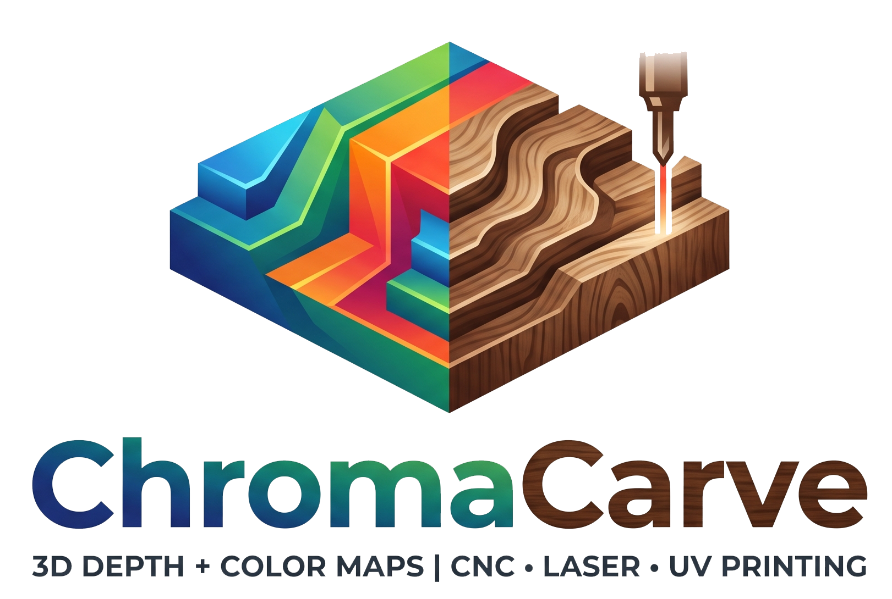

<p align="center">
  
</p>

# ChromaCarve

A browser tool for compositing a **color map** + a matching **depth/height map** for
CNC relief carving (depth only) and full-color 3D printing (depth + color). The
composite is built from three independently-optional parts, textured with procedural
materials, and previewed in a lit, orbitable 3D view — entirely client-side.

## Run

```bash
npm install
npm run dev      # http://localhost:5173
npm run build    # type-check + production build
npm test         # vitest unit tests
```

## Slices companion workspace

Open **Slices** in the workspace switcher, or visit **`/slices/`** directly.
The complete Slices workflow provides model setup, cross-sections, plywood comparison, assembly inspection, hidden markings and cutting-sheet export:
GLB/OBJ/STL import, animation-pose selection, an orbitable 3D source preview,
physical sizing, and automatic browser-local restoration. The **Cross-sections**
view shows each generated layer, including holes and separate pieces. **Compare**
shows the original and assembled plywood side by side. **Markings** previews hidden
alignment guides and piece numbers. **Sheets** arranges retained pieces and exports
millimetre SVG files or a ZIP with every sheet and a printable assembly guide.

In **Reliefs → Foreground → Model**, use **Open in Slices** to transfer the original
uploaded model and its selected animation pose. Primitives and bundled models
transfer as static STL snapshots. Relief effects and physical dimensions are not
transferred. Slices owns a separate model instance, so changing its pose or
replacing its model does not change the relief project. Switching workspaces in
the same tab preserves the relief project in memory; the existing relief JSON
save/import behavior is unchanged.

Slices stores the source file, pose, and physical setup in IndexedDB on the same browser
and origin. Refreshing or opening `/slices/` in another tab restores the last saved
Slices project without another upload. It is a local working copy, not a portable
project backup: clearing site data removes it, and concurrent tabs share the last
saved copy. If storage is unavailable or full, direct imports remain usable and
the workspace shows a persistence warning. Models are processed locally.

`npm run build` emits both `dist/index.html` and `dist/slices/index.html`. Deploy
the entire `dist` directory at the domain root. Static hosts that serve directory
index files can load and refresh `/slices/` without an SPA fallback or a new
domain. The existing deployment pipeline should publish the nested entry along
with shared assets. Tests cover parser ownership, original-source retention,
handoff isolation, pose restoration, storage-failure recovery, slicing geometry,
and worker cancellation.

### Plywood comparison

**Compare** uses the actual cross-section contours, extruded to measured material
thickness, with holes, disconnected pieces and empty-layer gaps preserved. It adds
no bevels or gaps between touching sheets. Neutral wood shading makes the stair
steps visible; **Show model colors** toggles the original GLB/OBJ materials.

Drag, scroll or right-drag either pane to rotate, zoom or pan both cameras together.
Focus a pane and use the arrow keys to pan. **Reset view** fits both models to one
common frame. Both panes always use the same scale and camera target; neither
model is independently resized to conceal differences. On narrow screens the
panes stack vertically. The caption reports layers, pieces and actual plywood
bounds in width × height × depth order.

Changes to pose, size, rotation, thickness or sampling offset rebuild the preview
in a cancellable worker and discard outdated geometry. Camera orientation, zoom
and pan survive these changes and preview-tab switches within the workspace.
Size changes retain framing relative to the requested longest dimension. Invalid
sections block the assembled preview; inspect them in **Cross-sections**. Empty
results and excessive preview complexity produce an actionable message. The
preview predicts shape only: glue, kerf, material variation, structural support
and assembly feasibility are not simulated yet.

### Optional section repair

For game models with overlapping parts or hidden openings, enable **Repair
overlapping / open sections** in Physical setup. Closed regions are unioned;
nearby matching endpoints are stitched. An open patch is filled only when its
closing edge is supported by existing material within the chosen **Repair
tolerance** (default 0.5 mm). Narrow strips attach nearby patches to the underlying
solid. Large unsupported openings and ambiguous branching paths remain errors.

Use **Cross-sections → Show original contours and repair connections** to compare
the repaired fill with the original segments. The same repaired pieces feed the
plywood comparison. This changes only derived sections, never the source model.
It preserves cavities and disconnected pieces and does not establish assembly
strength. Repair settings are saved; disabling repair restores strict slicing.

The [Captain Toad investigation](docs/slices-repair-captain-toad.md) documents all
50 default layers: 1 mm repair resolves every layer in the supplied rest pose,
while 0.5 mm leaves two eye-area paths unresolved on layer 26. Other poses may
still need attention. The copyrighted fixture is not shipped with the app.

### Physical setup and cross-sections

- **Longest side:** sets the physical size in millimetres before rotation, with
  proportions locked. Width, height, and depth are displayed alongside it.
- **Measured plywood thickness:** the actual sheet thickness, not just its nominal
  label. Every generated slab has this exact thickness.
- **Slice direction:** choose horizontal, front-to-back, or side-to-side sections,
  or rotate the model freely with XYZ Euler angles. Camera orbiting only changes
  the view; it does not change the slice geometry.
- **Sampling offset:** zero samples each slab at its midpoint. The allowed range
  is ±half the material thickness. This moves the sampling plane inside a fixed
  slab; it does not translate the slab or change the stack height.

The layer count is `ceil(rotated model height / material thickness)`, allowing
only numerical roundoff at exact multiples. The stack is centered around the
model, so any extra height is shared equally above and below. A 10 mm-tall model
in 3 mm plywood therefore has four layers spanning 12 mm. Requested dimensions,
rotated dimensions, planned stack height, and the height difference remain
explicit. If an offset creates empty layers, they keep their positions; the
span of the remaining usable layers is reported separately and can contain gaps.

Slicing takes an owned snapshot of the selected static pose. Its skinning,
morphs, and node transforms have already been baked by the shared importer;
physical scale and model rotation are applied in the worker. Changes cancel
outdated work immediately and start a new job after a short debounce. The UI
also provides **Cancel slicing** and **Retry slicing**.

Strict mode supports clean, consistently oriented, closed triangle meshes,
including disconnected components and correctly oriented cavities. It checks
welded mesh boundaries, face winding, and contour connectivity/intersections.
Outer contours wind counterclockwise in the slice frame (X, −Z); holes wind
clockwise. Open paths are never automatically closed. Overlapping solids,
same-oriented nested shells, and zero-width tangent connections are flagged,
not silently interpreted as valid cut pieces. Model repair and solid union are
not implemented yet. Closed contours alone are not an assembly-strength check.

Vertices on a slicing plane belong to its negative side: the result uses the
positive-side limiting section. Coplanar triangles do not contribute contours;
duplicate tangent edges cancel. A plane at the very top of a box is therefore
empty. A small sampling-offset change can avoid critical planes where regions
touch at a point. The layer inspector offers a shortcut to each invalid layer
and shows failed segments in red. All layer drawings retain a common scale and
origin, including empty layers.

Browser workloads are bounded to 1,000,000 input triangles, 2,000 layers, and
additional intersection/segment budgets. Exceeding a limit produces an
instruction to simplify the model or increase thickness, rather than silently
omitting geometry. No cut file is exported at this stage.

## The three parts

The image is composited from three parts, combined by **priority replace**
(`foreground ?? frame ?? background` per pixel). Each is toggled on/off independently
and has its own depth `min`/`max` (relative height units).

- **Foreground** — the main subject. Use an uploaded **GLB, OBJ or STL** or a procedural primitive
  (**torus, sphere, torus knot, cube**), freely oriented in an orbit gizmo. The depth map
  is the **orthographic** projection from the angle you set — what you see in the gizmo is
  what you get. Offset it in X/Y within the canvas.
- **Frame** — a border band whose cross-section is a Catmull-Rom **spline profile** (drag
  points; double-click empty space to add a point, double-click a point to remove it),
  with its own width and fill.
- **Background** — an uploaded **image** (Gaussian blur + brightness/contrast/desaturation;
  flat constant depth), an **OBJ/primitive tiled** across the canvas at a chosen interval
  (overlaps take the per-pixel **max** height, e.g. dragon scales), or a **solid color**.

Output size is physical (mm + px/mm).

## Animated GLB foregrounds

Upload a self-contained `.glb` in **Foreground → Model → Your model**. Textures,
base colors and vertex colors are preserved. Choose an **Animation** and scrub
**Pose time** to select the static pose used for the foreground, bas-relief and
PNG exports. **Rest pose** uses the model without animation. Skeletal, morph-target
and node-transform clips are supported; the timeline is in seconds because GLB
clips do not specify a universal frame rate.

**Use model colors** is enabled by default for GLB models. Turn it off to apply a
ChromaCarve procedural fill. The orbit gizmo shows the original model colors;
AO and curvature controls can shade the resulting color map.
PBR materials retain their metallic/roughness and normal textures, with **Studio
lighting** enabled by default. The local studio environment supplies softbox
reflections; **Studio intensity** adjusts their brightness. These reflections are
baked into the color PNG from the selected view, without changing the depth map.
Turn studio lighting off for the original flat base colors. Unlit game materials
remain unlit. Transparent material
regions are treated as cutouts (blended materials use a 50% threshold), since a
height map can represent only one surface per pixel.

Project JSON saves the animation selection and time, but does not embed the GLB.
Re-upload the same filename after importing settings to restore the selected pose.
GLB support is for foregrounds; background uploads remain OBJ/STL.

## Geometry smoothing

Enable **Foreground → Model → Smooth geometry** to curve coarse triangles using
surface normals (PN-triangle subdivision). This changes the actual surface used
by the gizmo, color projection, depth map and bas-relief solver. It is off by
default and is applied after selecting an animation pose.

Choose **Subdivision** (4, 16 or 64 triangles per original face) and adjust
**Smoothing strength**. The original vertices, texture seams and material groups
are retained; edges with split normals remain sharp and connected. Smooth authored
normals give the best results. Lower the strength if small details bulge or nearby
surfaces start intersecting. Subdivision is capped at 500,000 output triangles,
with a notice when the selected level cannot fit. Settings are saved in project JSON.

## Materials

Every part is textured with a **Fill**, evaluated procedurally in canvas space:

- **Solid color.**
- **Wood grain** — a volumetric model with three grain layouts: **flat-sawn** and
  **end-grain**, where grain lines are slices through concentric growth-ring cylinders
  around a wandering pith axis (realistic cathedral flames, irregular ring spacing, thin
  latewood lines, high-frequency pores, heart-colour zoning); and **figured**, a
  domain-warped-noise wood with dense fibrous grit and knots (see credits). Species
  presets: **Walnut, Oak, Mahogany, Redwood, Poplar, Olive, Rosewood**. Knobs cover ring
  density, pith depth/wander, grain turbulence, line sharpness, colour zoning, pores,
  figure streak, per-ring variation and saturation.
- **Stone** — volumetric **marble, onyx, sandstone, granite, terrazzo, travertine** and
  **cracked** stone (veins, strata, Voronoi aggregates/cracks), with curated presets.

Wood and stone are sampled in 3D, so their veins/rings carve correctly through raised and
recessed relief. A 🎲 button randomizes the material seed. **Micro-relief** can emboss a
material's feature lines (wood grooves, marble veins, travertine voids) into the depth map.

## Depth & relief

The foreground offers two **geometry modes**:

- **Bas-relief** — gradient-domain relief (Fattal et al. 2002 / Weyrich et al. 2007):
  dissolves silhouette cliffs and compresses large gradients while preserving fine detail,
  controlled by compression (β), detail level (α) and edge emergence.
- **Pure depth** — the raw orthographic height field, with an edge-falloff option to
  feather vertical silhouette cliffs.

Shared depth controls: maximize/normalize the range, detail (unsharp mask), a depth curve
(γ), and 2× supersampling for cleaner edges. **Shading** can bake ambient occlusion and
fine curvature (concave/convex) shading into the colour map.

## 3D preview

The full-viewport preview displaces a high-res plane by the depth map, shaded in-shader
with a specular highlight and a key light:

- **Drag** to orbit (constrained to the front hemisphere so you can't swing behind the
  relief), **scroll** to zoom, **right-drag** to pan.
- Toggle **Rotate light source** to sweep the light or hold it in place.
- In the foreground orbit gizmo (an orthographic view matching the exported maps), the
  **scroll wheel** drives the model zoom and a **Roll** slider rotates about the view axis.

`previewMaxDepthMm` and preview px/mm only affect the on-screen preview, not the export.

## Export

- **Depth PNG** — 16-bit grayscale, normalized so the used range spans full black→white
  (the PNG carries no physical scale — set that in your CAM/slicer).
- **Color PNG** — 8-bit RGBA.
- **Settings JSON** — all parameters (binary assets are referenced by filename; re-upload
  them after importing).

## Architecture

- `src/state/store.ts` — Zustand project model (= the JSON export schema).
- `src/pipeline/` — offscreen Three.js render-target pipeline: per-part color/depth/mask
  stages + the priority-replace compositor, all on float targets. `shaders.ts` holds the
  shared procedural core and the wood/stone material shaders.
- `src/obj/ModelDepthPass.ts` — orthographic model→height-map renderer (shared by the
  foreground, the background tile and the orbit gizmo).
- `src/relief/` — gradient-domain bas-relief solver (Poisson/DCT), run in a worker.
- `src/spline/profile.ts` — Catmull-Rom profile sampling for the frame LUT.
- `src/three/Viewer3D.tsx` — displacement mesh, in-shader normals, key light + specular.
- `src/io/` — PNG (`fast-png`) and project-JSON export/import.

## Credits

- The **figured** wood grain layout is an independent reimplementation of the technique in
  [dean_the_coder](https://twitter.com/deanthecoder)'s "Procedural Wood" shader
  ([shadertoy.com/view/mdy3R1](https://www.shadertoy.com/view/mdy3R1)) — domain-warped noise
  flow with a spectral-fBm tone transfer and fine anisotropic grain. Its **algorithm** was
  reimplemented here on ChromaCarve's own noise primitives and code (no source was copied);
  the original shader is licensed CC BY-NC-SA 3.0. With thanks to the author.
- 3D simplex noise: Ashima Arts / Stefan Gustavson (MIT, webgl-noise).

### Assembly inspection (milestone 4)

The **Assembly** tab checks the exact generated or repaired pieces in the slicing
worker. It measures the glue-contact area between adjacent layers, excluding
holes and zero-area edge/point contacts, and groups pieces by those connections.
It distinguishes groups disconnected from the bottom layer from hanging pieces
that connect through a higher layer and may require a different assembly order.
Empty layers do not create connections across a gap.

Review warnings identify tiny pieces, narrow pieces or connecting necks, and
small contact areas. The initial screening thresholds scale with measured plywood
thickness: area below thickness², glue contact below thickness² or 10% of the
piece area, and width/neck screening using an inward offset of half the thickness.
These are geometric heuristics, not strength guarantees; grain, glue, kerf,
material variation and fragile protrusions still need judgment. The explanatory
panel displays the actual thresholds. Separate connected groups need additional
connections to form one assembled model.

Orange highlights pieces with warnings. **Next review piece** steps through them;
selecting any piece colors it blue, reports its area and contacts by piece ID,
and hides layers above it. **Layers shown** can reveal the stack progressively.
**Exploded gap** separates layers visually without changing fabrication geometry
or reported assembled dimensions. Both panes retain synchronized cameras; use
**Reset view** to fit the exploded stack. Inspection controls are temporary and
reset when the generated result changes. Analysis errors are shown explicitly and
do not prevent inspecting otherwise valid geometry in Compare.

**Suggested omissions** identifies tiny terminal details. You can omit suggestions
or individual pieces, restore them, and show exclusions as red stippled ghosts.
Compare, Cross-sections and Markings consume the retained pieces. Contact checks
update immediately. Omissions are saved and cleared when pose or slicing settings
change. No pieces are automatically deleted or bridged by assembly analysis.

### Hidden assembly markings (milestone 5)

The **Markings** tab shows top-face cut contours in red and alignment/number paths
in blue. Choose a layer or enlarge an individual piece. Toggle **Show next layer
coverage** to inspect where the next pieces cover the current face. A review menu
jumps to contacts that cannot receive a guide or a complete pair of numbers.

Each positive-area contact gets a separate ID pair: current piece on the first
line, `>next-piece` on the second. Numbers use single-stroke vector paths, with no
font dependency. Both rows must fit inside a fully covered rectangle, accounting
for holes and concave boundaries. A bounded placement search tries horizontal
and quarter-turn orientations. It may miss a possible placement; missing labels
are explicitly reported and never clipped or placed on exposed material.

Alignment guides trace only the next piece's inset boundary where supported by
the current piece. They never substitute an artificial overlap boundary. At the
default 0.5 mm hidden margin and nominal 0.1 mm marking stroke, the guide centerline
is 0.55 mm inside the next piece’s material. Allow that offset when aligning
outer edges and holes.
Partial guides may not uniquely determine placement, especially for symmetric
parts. If the next piece overhangs every edge, no next-piece boundary is available
and the contact is flagged for manual alignment. Tiny contacts may receive no
marks at all. Pieces with no retained piece above have no top-face markings.

Margin and number height are saved independently of slice settings and omissions.
Generation runs in a cancellable worker; obsolete results are hidden immediately.
All geometry stays in the original millimetre slice frame, retaining piece IDs
and physical layer positions. Nesting/export must transform each piece and its
mark paths together. The 0.1 mm preview stroke is nominal, not a measured laser
burn width. Cutting-sheet packing, kerf compensation and SVG download are available
in **Sheets**, described below.


### Cutting sheets and kerf (milestone 6)

**Sheets** arranges retained pieces on one or more physical sheets. Width, height,
edge margin, part gap, measured kerf and optional quarter-turns are saved with the
project. IDs shown on the sheet are preview references, separate from hidden
physical markings. Locate any piece by ID, including pieces with no hidden label.

The worker runs deterministic MaxRects packing with three ordering heuristics,
choosing the fewest sheets then the smallest occupied bounding area. Packing uses
enclosing rectangles; it does not interlock outlines or nest within holes.
Quarter-turns rotate cuts and markings together without mirroring. Disable them
to retain a common grain direction. This is a practical layout, not an optimality
guarantee. Jobs are limited to 2,000 retained pieces and 200 sheets, with bounded
search and explicit oversize/complexity errors.

Kerf defaults to zero. A nonzero measured cut width offsets outer contours outward
and hole contours inward by half that width. Hole/topology loss is an error, never
a silently filled hole. Packing reserves the entire burn envelope plus the part
gap, and keeps the burn envelope inside the edge margin. Do not apply compensation
again in laser software when it has already been applied here. Review assembly
and marking warnings before fabrication; those warnings are not repaired by packing.


### SVG and assembly-guide export (milestone 7)

Use **Download sheet SVG** for the selected sheet, **Download all (ZIP)** for the
complete job, or **Assembly guide** for the standalone printable HTML guide.
The ZIP contains `sheet-01.svg`, additional numbered sheets as needed,
`assembly-guide.html`, `project-summary.json`, and `README.txt`. No source mesh is
embedded in the export. Downloads remain entirely local to the browser.

Each SVG has physical `width` and `height` in millimetres, a matching viewBox,
baked coordinates, no font dependency, and two named operation groups:

- Blue `#0000ff`: hidden alignment and number marking paths.
- Red `#ff0000`: closed cutting paths, holes before outside contours.

Marks are written before cuts. Confirm operation order in the laser software,
since importers can reorder paths. Import at 100% scale and keep the marked face
up. Preview-only piece IDs, selection fills, sheet edges and margin lines are
never exported as laser paths. Numbers are single-stroke paths; SVGs contain no
text elements, images, clipping masks, or per-piece transforms. Nominal 0.1 mm
stroke width is not a power/speed setting. ZIP output is uncompressed and bounded
to 100 MB; oversized jobs can be downloaded sheet by sheet.

The guide contains numbered sheet maps, a top view for every retained piece,
its sheet location and rotation, above/below contacts and assembly/marking
warnings. Tiny and narrow pieces have enlarged sheet-location details instead
of overlapping map labels. Guide maps and thumbnails are references, not
full-scale cutting templates. The JSON summary preserves setup, omissions,
marking and sheet settings, and the per-piece inventory; it does not replace
saving the original model. Project settings, including omissions, remain saved
in browser storage.

### Verification and practical limits

The full suite covers original model imports, repair, contact analysis, omissions,
hidden marking containment, packing gaps and bounds, kerf topology checks, rigid
rotation, SVG operation order/units, ZIP checksums, escaping and saved settings.
The optional Captain Toad integration test uses a locally supplied asset; no
proprietary model data is checked into the repository. See
`docs/slices-repair-captain-toad.md` for the measured example.

Packing remains rectangle-based and can use more sheets than a polygon nesting
optimizer. The app does not choose laser power/speed or simulate material
strength. Some pieces cannot receive hidden IDs or enough alignment segments;
the guide identifies these explicitly. Geometry and exported files have been
verified in software; a physical laser-cut assembly has not been tested here.
